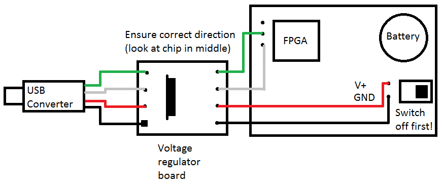
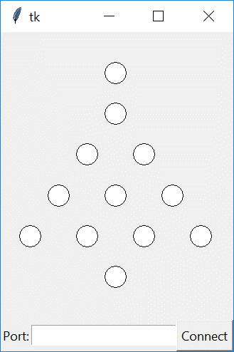

# xmascard
Merry Christmas!


Of course, this is a little late for Christmas; by now it's probably closer in temperature in the southern hemisphere. Nevertheless, better late than never.

Welcome to the Electronic Christmas Tree Christmas Card. As you no doubt figured out already, to get started just flip the switch and enjoy the light show. (If it’s not working, try moving the battery around a little; the bottom doesn’t always make a solid connection to the board.)

Additionally, this board is intended to be at least somewhat more than just an amusement; you can do things with it, and the entire schematic and program are open source on GitHub for you to see.

It’s powered by a Xilinx FPGA, and you can add new patterns by connecting a serial cable to three pins near the FPGA with the included USB-serial adapter.

## History
The idea of this board started when Emily was playing with an Arduino one Christmas while I was looking at one of the myriad cards we’d received from friends, and I was remarking that it would be neat to take one of our Arduinos, some leftover LEDs, and see what sort of Christmas tree shaped thing we could make as a geeky card of some sort. The Arduino had 13 I/O ports, so a few minutes of brainstorming later, she came up with a 12 LED Christmas tree that looked neat.

As is my style, I couldn't leave well enough alone and keep things simple, however. First, as an undergrad I'd designed my own printed circuit boards (PCBs) and thought this would be a good excuse to re-learn how to do it. So, instead of a few LEDs wired up to an Arduino, it turned into a custom board. Additionally, I did my master’s thesis on FPGAs and I wanted an excuse both to work with them again, as well as the opportunity to introduce people to them. Given that, I thought it would be fun to use an FPGA in this Christmas card because it's typically seen as this exotic thing that is expensive and only used in specialize projects, and I wanted to change that perception.

This idea was actually conceived in January of 2015; I had no idea it would be so hard or take so long, but here we are, a year and a half later and I've finally stopped procrastinating enough to get something out the door.

## Interacting with the board
Initially, when this was just going to be a simple one-month project, the goal was just to display a pretty light pattern when you flipped the switch.

However, eventually the former-TA inside got the better of me and I decided I wanted to make it a little more interesting than just something you looked at once and put in a drawer. Toward that end, you'll also find some additional gizmos that you can use, with some assembly required, to interact with the board with your computer.

Included with the board are a USB-serial converter cable, a voltage regulator board, and some jumper wires to connect them together.

To get started, connect those pieces to the FPGA according to the following diagram:


If you're on a Windows or Linux computer, you're all set to run the programs.

If you're on a Mac, you'll need to download and install the driver for the USB-serial converter. Follow [the instructions](https://learn.adafruit.com/adafruits-raspberry-pi-lesson-5-using-a-console-cable/software-installation-mac) on AdaFruit's site this website for the SiLabs CP210X Drivers.


That done, double click the `light_control.py` file on your computer. It should open a window that looks similar to the following:


Click **Connect**, and follow the instructions. It will ask you to plug in the Christmas Tree board, and if all goes well, it will print that it was successfully connected in the bottom of the window.

Now that you're connected, click any of the lights on the tree. They should change on the board, too! :)

## Creating your own patterns
What else can you do? Well, you can make your own patterns, using the `convert_animation_file.py` and `upload_new_pattern.py` programs.

These programs accept text files containing animations patterns and downloads them to the board for display.

The animation files work like so:

Each step in the animation is specified on a line. Each line specifies the brightness of the LEDs, from the top left to the bottom right. Each LED is two digits from 0 to 7 for the red, then green brightness. The value 0 is off, while 7 is all the way bright. For readability, spaces can be added as desired and are ignored.

For example, to light the red LED on the top, then the entire row of green on the bottom, the line would look like the following:

```
70  00  00 00  00 00 00  07 07 07 07  00
```

Since that can still be hard to read, you can alternately put the LEDs on different lines and separate each step in the animation with a blank line.

This allows you to write the pattern out visually. For example, the above example could also be written as:

```
            70
            00
          00  00
        00  00  00
      07  07  07  07
            00
```

The animation runs at a fixed speed of # frames per second, and the board stores 256 animation steps for a total of # seconds of animation. If you don't use all 256 frames of animation, the program will just repeat the last frame until memory is full.

In order to make it a little easier to create animations, you can tell the program to fade between animation steps automatically.
For example, to create an animation which fades between all the LEDs on, off again, then back on, create a text file like so:

```
set_marker
       77
       77
     77  77
   77  77  77
 77  77  77  77
       77
       77
fade_to
       00
       00
     00  00
   00  00  00
 00  00  00  00
       00
fade_to
       77
       77
     77  77
   77  77  77
 77  77  77  77
       77
       77
repeat_forever
```

Suppose your text file is named animation.txt. First, convert it to an FPGA memory entry like so:
```
convert_animation_file.py animation.txt memory.txt
```
Next, program it to the FPGA like so:
```
upload_new_pattern.py COM3 memory.txt
```
You can find the correct value to use for COM3 by running the `light_control.py` and looking at the value in the box at the bottom of the program after clicking **Connect**.
If everything went well, you should see your animation running on the FPGA. If not, well, you can either treat this as an exercise in learning about Python, or email me and I'll help. :)

## Building the Project For Yourself
It's also possible to build the hardware design that runs on the FPGA for yourself, in order to experiment with making changes. To do so, follow these instructions. Note that while you don't need any additional hardware to build and simulate the hardware design, you will need either a flash memory programmer or a JTAG cable in order to actually try out your design on the actual board.

### Tools required for design synthesis:
- Xilinx ISE. Version 14.7 tested, but any reasonably recent version should work.
	As of mid-2017, for Windows, follow these steps to obtain it:
	- Navigate to xilinx.com
	- Scroll to bottom, click Downloads and Licensing.
	- Click ISE tab.
	- Choose either the multi-part or full download of ISE.
	- Create a new account.
	- Once software is installed and it asks for a license, choose a WebPack license.
	- **NOTE:** If running on Windows newer than Windows 7 (Windows 8.1 or Windows 10 at the time of this writing), follow [this application note](https://www.xilinx.com/support/answers/62380.html) to modify one of the DLLs included with the software to avoid a crash.

- Python. Python 2.7 or later is fine.

### Tools required for programming a new design:
- A way to write new images to a SPI flash chip. For this project, I used:
	- [FlashROM for Windows](http://ra.openbios.org/~idwer/flashrom/mingw/)
	- [BusPirate v3.6](http://dangerousprototypes.com/docs/Bus_Pirate)

- Alternately, a JTAG programmer. For this project, I used:
	- the [Digilent JTAG-HS3](http://store.digilentinc.com/jtag-hs3-programming-cable/) cable along with the Adept software (at the same link).


### Creating the built-in waterfall pattern
Before synthesis, open a command prompt and run the following two commands in the root of the directory where you cloned the project:
```
gen_top_down_waterfall_pattern.py built_in_pattern.txt
mif2coe.py built_in_pattern.txt > hdl\waterfall.coe
```

These commands generate the build-in waterfall image and format it in a way that the Xilinx tools accept into the on-FPGA BlockRAM memories.

### Synthesizing the design
- Launch the *Xilinx ISE Project Navigator*.
- Click *Open Project*, and choose `hdl\xilinx_project\xilinx_project.xise`.
- In the *Design* tab on the left of the screen, double-click on *Generate Programming File*. This will also run the *Synthesize* and *Implement Design* steps.
	- The tool will prompt about regenerating the `ram72bit` IP core. Click *Yes* to allow it to do so.
	- When complete, none of three steps should have a red X next to their name, and there should be a file `hdl\xilinx_project\lights.bit` containing the image to be programmed on the FPGA.

### Programming the design to the flash memory
- First, you'll need to connect the pins of the BusPirate to the pins of the flash memory chip.
	- Google for `MX25L4006E datasheet` to find the pinout of the memory chip.
	- Use a breadboard and some jumper wires to connect the two together.
- Open *Device Manager* and expand the *COM ports* section, then find the one associated with your BusPirate.
- Open `create_and_program_prom.cmd` in a text editor (right-cliking and choosing Edit will open it in Notepad, which is fine) and change the `COM#` to match what you found above.
- Open the *ISE Design Suite Command Prompt* as Administrator (by right-clicking on it) from the *Xilinx Design Tools* folder in the Start Menu.
- Navigate to the root directory of your clone.
- Run `create_and_program_prom.cmd`.

### Programming the design with the Digilent JTAG-HS3 JTAG programmer
- Power the FPGA by connecting it to the PC using the USB-serial cable.
- Connect the JTAG programmer to the connector on the FPGA.
- Run the Adept software. It should find the FPGA.
- Click *Browse*, choose `hdl\xilinx_project\lights.bit`, click *Program*.
